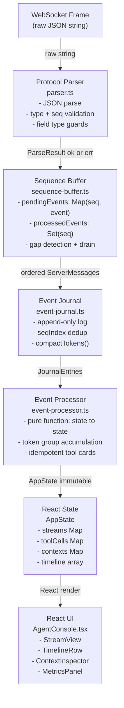
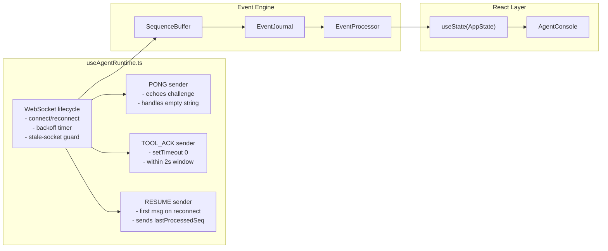
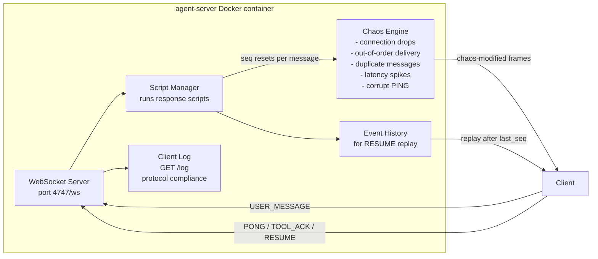

# Architecture

## Data Pipeline

Every WebSocket frame flows through a strict, unidirectional pipeline. UI components never parse raw frames.

## Component Responsibilities

## Agent Server (provided, unmodified)

> **Key insight from reading server.ts:** The server resets `seq = 0` and `eventHistory = []` on each `USER_MESSAGE`. This means `SequenceBuffer.resetForNewTurn()` (which resets `expectedSequence = 1`) is correct — not a bug.
