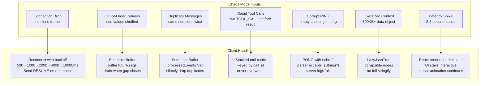
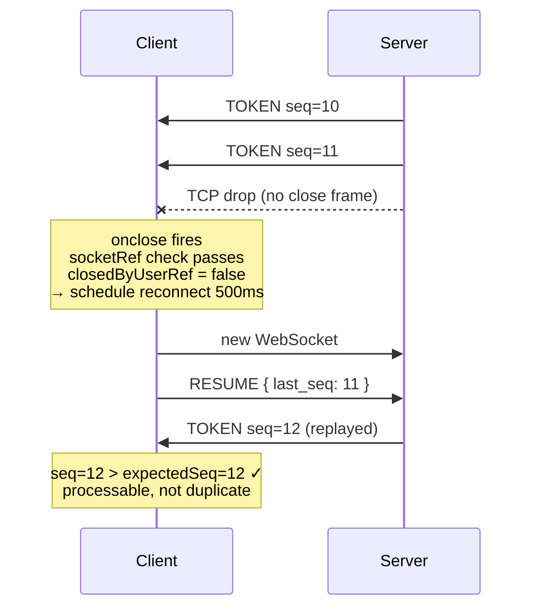
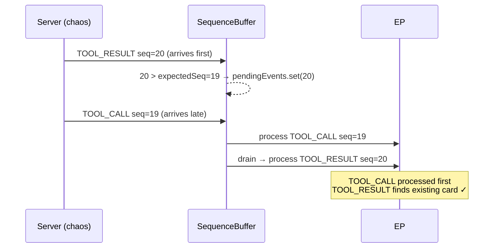
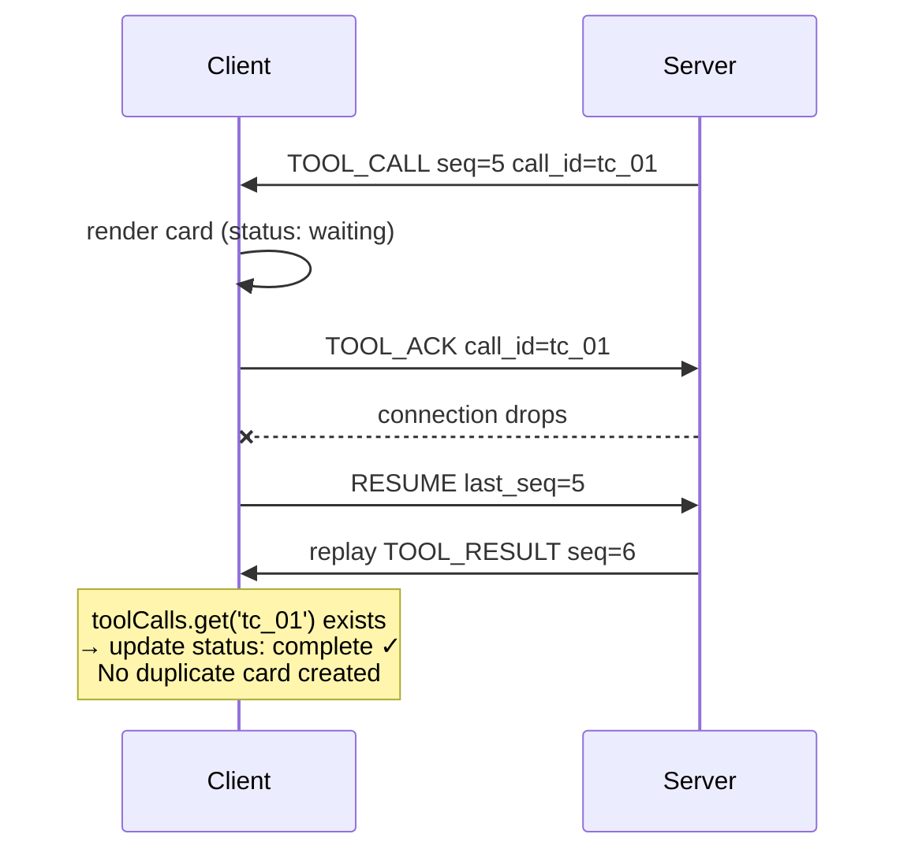
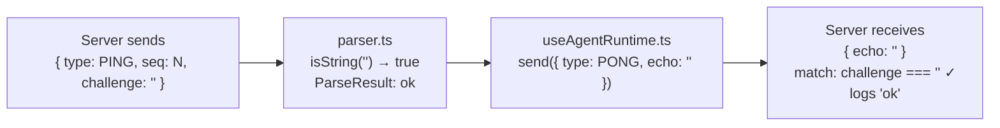

# Failure Modes

Every chaos-mode failure is handled explicitly. This document maps each failure to its detection mechanism, handling strategy, and the test that covers it.

## Failure Map

## Detailed Scenarios

### 1. Connection Drop Mid-Stream

**What must NOT happen:** The reconnect must not trigger if the socket was intentionally closed (`closedByUserRef = true`) or if a stale socket closes after being replaced (`socketRef.current !== socket`).

---

### 2. Out-of-Order Tool Result (Critical Race)

If TOOL_RESULT were processed before TOOL_CALL, the card would not exist and the result would be lost. The sequence buffer guarantees ordering.

---

### 3. TOOL_ACK Race Condition

**This is the race the assignment says to look for.** The fix is that `processServerEvent` for `TOOL_RESULT` always does `get` then `update` — never `set` on a new key unless the key doesn't exist.

---

### 4. Corrupt PING

**No crash.** The parser accepts empty strings for `challenge` because `isString("")` returns `true`. The PONG is sent with `echo: ""` which exactly matches the challenge.

---

### 5. Oversized Context (500KB+)

The `ContextInspector` uses `LazyJsonTree` which renders JSON as a collapsible DOM tree rather than a single `JSON.stringify` into a `<pre>`. Only expanded nodes render their children. An object with 1000 keys renders as a single collapsed `{ 1000 keys }` button until clicked.

| Approach | 500KB payload |
|---|---|
| `<pre>{JSON.stringify(data)}</pre>` | Freezes tab during stringify + DOM insertion |
| `LazyJsonTree` (our approach) | Root renders instantly; children mount on demand |

## Failure Coverage in Tests

| Failure Mode | Test File | Test Name |
|---|---|---|
| Out-of-order delivery | `sequence-buffer.test.ts` | "buffers future events and drains after gap" |
| Fully reversed sequence | `sequence-buffer.test.ts` | "drains a fully-reversed sequence [5,4,3,2,1]" |
| Duplicate messages | `sequence-buffer.test.ts` | "deduplicates processed and pending events" |
| Out-of-order TOOL_RESULT | `chaos/out-of-order-tool-result.test.ts` | "buffers TOOL_RESULT until TOOL_CALL is processed" |
| Token idempotency | `event-processor.test.ts` | "does not duplicate token text for same seq" |
| Rapid tool calls | `event-processor.test.ts` | "handles two sequential tool calls without overwriting" |
| Context dedup | `event-processor.test.ts` | "does not duplicate a snapshot with same seq" |
| Corrupt PING | `event-processor.test.ts` | "handles empty challenge without throwing" |
