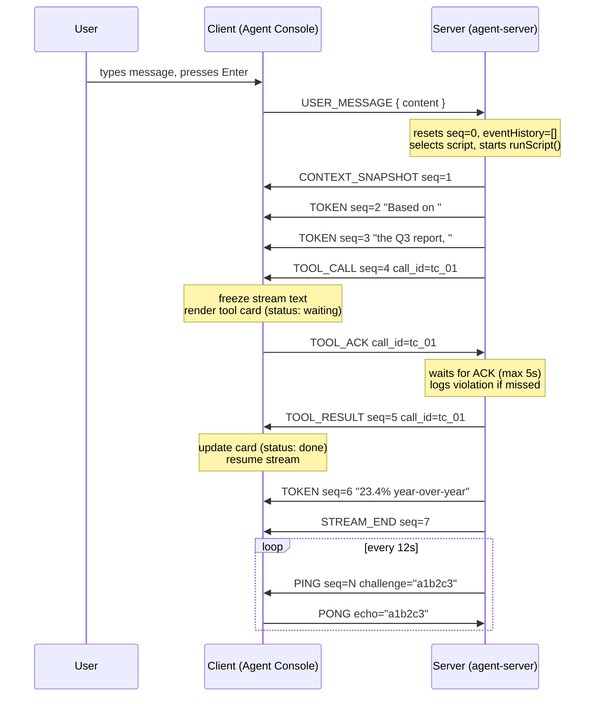
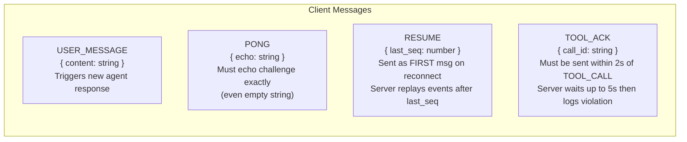
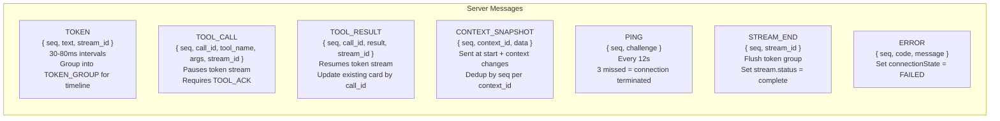
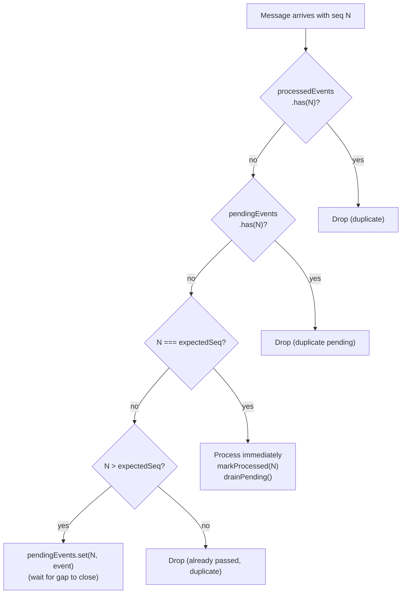

# Protocol Analysis

Complete reference for the WebSocket protocol spoken between Agent Console and `agent-server`.

## Message Flow Overview

## Client → Server Messages

## Server → Client Messages

## Sequence Number Rules

## Protocol Compliance Checklist

The server's `/log` endpoint verifies these. Evaluators will check it.

| Requirement | Implementation | Where |
|---|---|---|
| PONG within 3s of PING | `send({ type: "PONG", echo: challenge })` in `onmessage` | `useAgentRuntime.ts:78` |
| PONG echoes exact challenge | `echo: parsed.message.challenge` (passes `""` correctly) | `useAgentRuntime.ts:78` |
| TOOL_ACK within 2s | `window.setTimeout(() => send(TOOL_ACK), 0)` | `useAgentRuntime.ts:48` |
| RESUME as first msg on reconnect | Sent in `socket.onopen` before any other message | `useAgentRuntime.ts:65` |
| RESUME uses lastProcessedSeq | `stateRef.current.metrics.lastProcessedSeq` (not lastReceivedSeq) | `useAgentRuntime.ts:62` |
| Deduplication by seq | `processedEvents: Set<number>` in SequenceBuffer | `sequence-buffer.ts:19` |
| Out-of-order handling | `pendingEvents: Map<number, ServerMessage>` | `sequence-buffer.ts:18` |
| Corrupt PING handled | `isString("")` = true → PONG sent with `echo: ""` | `parser.ts:53` |
