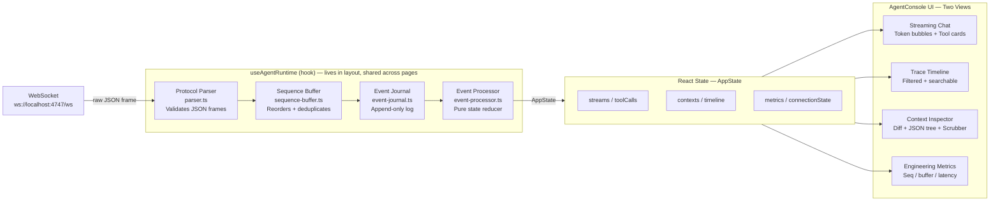
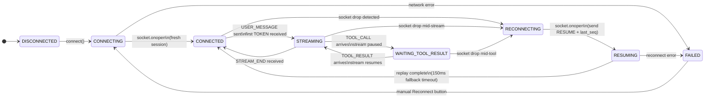
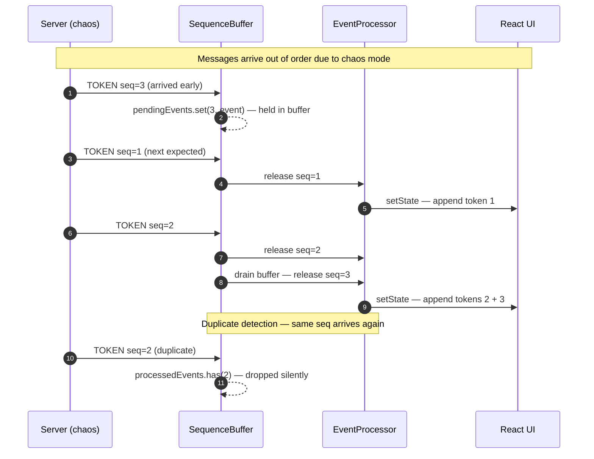
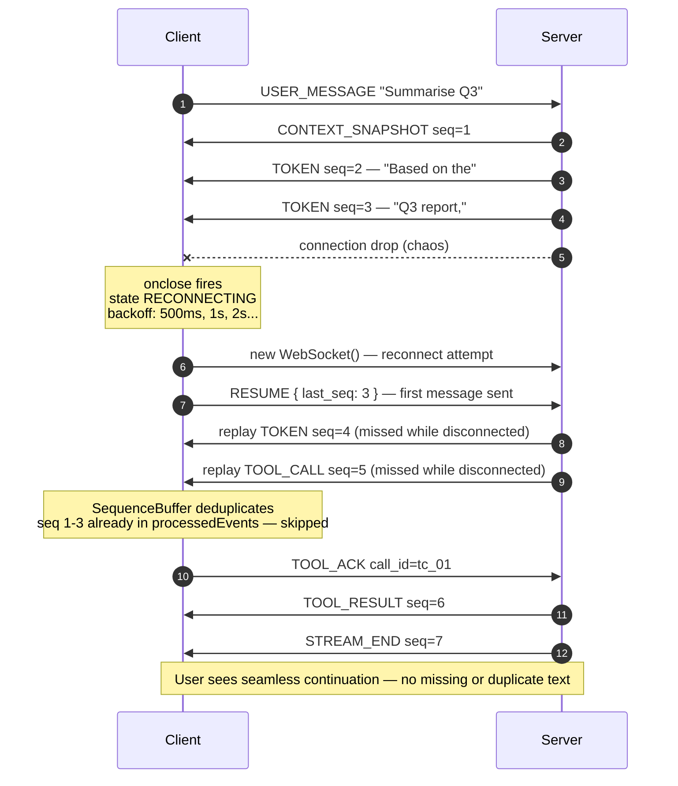
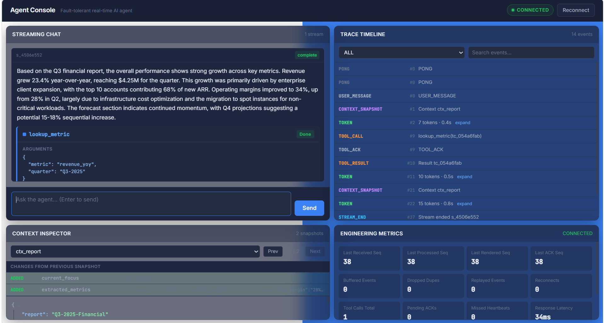
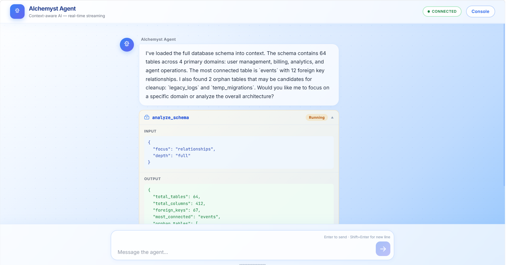

# Agent Console

Agent Console is a Next.js 14 App Router frontend for the Alchemyst AI real-time agent . It treats WebSocket streaming as a **distributed-systems problem**: every frame passes through protocol validation, sequence buffering, deduplication, an append-only Event Journal, an idempotent event processor, and only then reaches React UI state.

## Documentation Directory

Please review the following extensive engineering documentation for a deep-dive into the system architecture and decision-making process:

| Document | Contents |
|---|---|
| **[DECISIONS.md](./DECISIONS.md)** | Rationale for sequence buffering, UI freezing, and state recovery |
| **[ARCHITECTURE.md](./ARCHITECTURE.md)** | High-level system design and data flow |
| **[FAILURE_MODES.md](./FAILURE_MODES.md)** | Edge cases, chaos mode survival, and the hidden `TOOL_ACK` race condition |
| **[STATE_MACHINE.md](./STATE_MACHINE.md)** | Formalized WebSocket connection lifecycle and transitions |
| **[PROTOCOL_ANALYSIS.md](./PROTOCOL_ANALYSIS.md)** | Breakdown of the server protocol and payload rules |
| **[TESTING.md](./TESTING.md)** | Test suites covering idempotency and sequence reordering |

---

## Architecture

> End-to-end data flow from raw WebSocket frame to rendered React UI.



---

## Connection State Machine

> The client's WebSocket lifecycle. Every state transition is explicit and observable via the connection badge in the UI.



---

## Sequence Buffer — Chaos Mode Reordering

> How out-of-order and duplicate `seq` values are handled without corrupting state.



---

## Reconnection / RESUME Flow

> How a mid-stream connection drop is made invisible to the user.



---

## Run

```powershell
# 1. Start the mock agent backend
docker build -t agent-server ./agent-server
docker run -p 4747:4747 agent-server

# 2. Start the frontend (always port 3001)
npm install
npm run dev
```

Open **http://localhost:3001** — or **http://localhost:3001/chat** for the dedicated chat view.

```powershell
# Chaos mode
docker run -p 4747:4747 agent-server --mode chaos
npm run dev
```

Server compliance log: `http://localhost:4747/log`

---

## Run Tests

```powershell
npm test
```

**30 tests** across 5 suites: sequence buffer, event processor, JSON diff, state machine, chaos edge cases.

---

## Screenshots

### Normal Mode — Streamed Response with Tool Call



### Trace Timeline + Engineering Metrics


