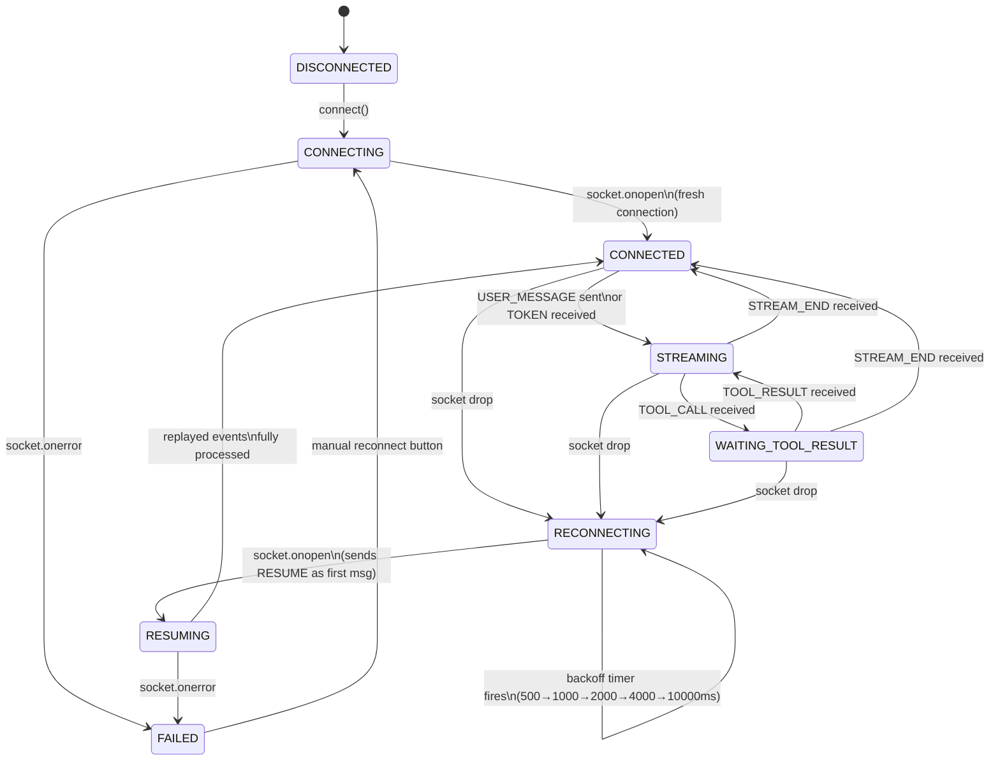
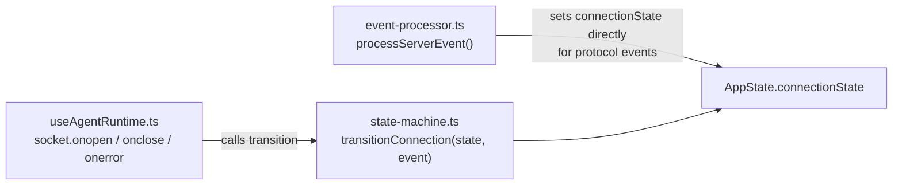

# State Machine

The WebSocket connection lifecycle is modelled as an explicit finite state machine. Every state transition is validated — invalid events for the current state are no-ops.

## State Diagram

## Transition Table

| Current State | Event | Next State | Side Effect |
|---|---|---|---|
| DISCONNECTED | CONNECT | CONNECTING | Open WebSocket |
| CONNECTING | OPEN (fresh) | CONNECTED | Start heartbeat |
| CONNECTING | OPEN (reconnect) | RESUMING | Send `RESUME {last_seq}` |
| CONNECTING | FAIL | FAILED | Show error |
| CONNECTED | USER_MESSAGE | STREAMING | Send USER_MESSAGE |
| CONNECTED | DROP | RECONNECTING | Schedule backoff |
| STREAMING | TOOL_CALL | WAITING_TOOL_RESULT | Freeze stream text, show card |
| STREAMING | STREAM_END | CONNECTED | Flush token group |
| STREAMING | DROP | RECONNECTING | Schedule backoff |
| WAITING_TOOL_RESULT | TOOL_RESULT | STREAMING | Update card with result |
| WAITING_TOOL_RESULT | DROP | RECONNECTING | Card stays "waiting" |
| RECONNECTING | OPEN | RESUMING | Send `RESUME` first |
| RESUMING | RESUME_COMPLETE | CONNECTED | Normal operation |
| FAILED | CONNECT | CONNECTING | Manual retry |

## Implementation

> **Design note:** `transitionConnection` is a pure function exported separately from the hook so it can be unit-tested in isolation without mocking WebSocket. The hook owns the actual socket lifecycle.
