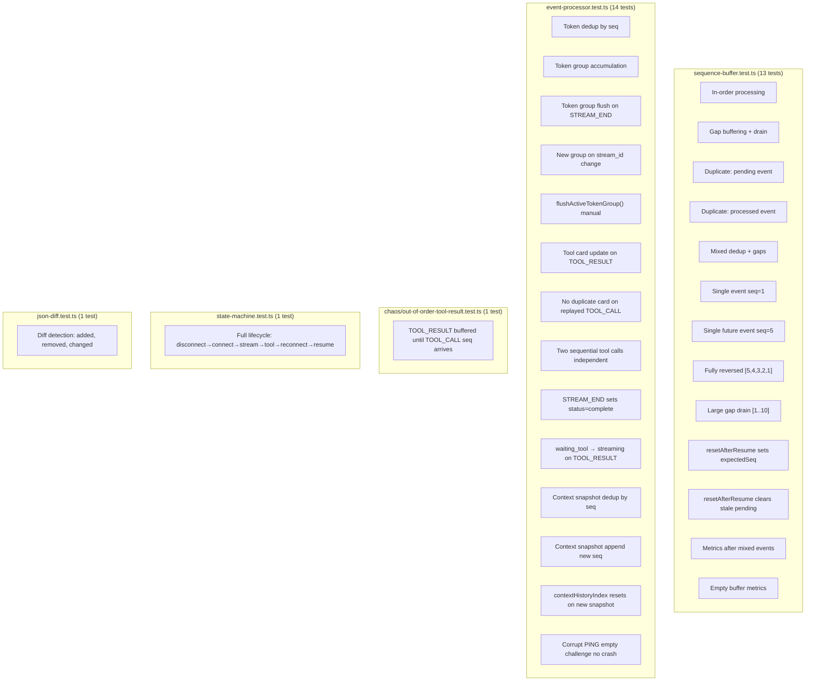
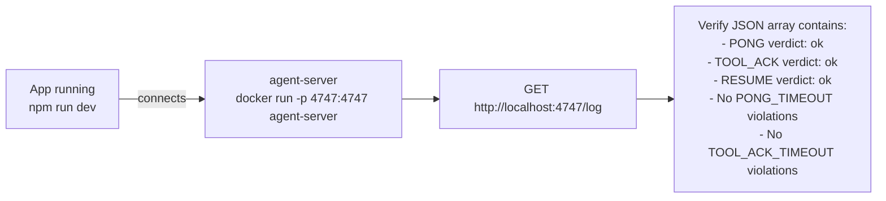
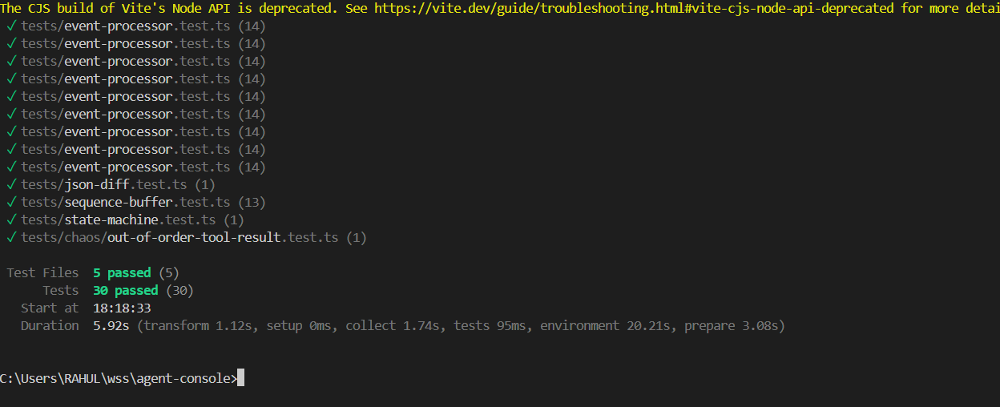

# Testing

## Run

```powershell
npm test        # run all 30 tests once
npm run test:watch  # watch mode
```

## Test Coverage Map



## What Each Test Proves for the Assignment

| Assignment Requirement | Covered By |
|---|---|
| Out-of-order messages rendered correctly | `SB2`, `SB8`, `SB9`, `C1` |
| Duplicate messages deduplicated | `SB3`, `SB4`, `SB5`, `EP7`, `EP11` |
| Token text not duplicated on replay | `EP1` |
| Tool call card not duplicated on replay | `EP7` |
| Tool calls resolved independently | `EP8` |
| TOOL_RESULT finds existing card (no new card) | `EP6` |
| State machine transitions correct | `SM1` |
| Context diff correctly computed | `JD1` |
| Token group accumulates, flushes on boundary | `EP2`, `EP3`, `EP4`, `EP5` |
| RESUME sends correct last_seq | `SB10`, `SB11` |
| Corrupt PING handled without crash | `EP14` |

## Protocol Compliance Verification (Manual)

After running the app against the server, check `http://localhost:4747/log`.



### Expected `/log` entries after a normal session

```json
[
  { "type": "USER_MESSAGE", "verdict": "ok" },
  { "type": "PONG",         "verdict": "ok",    "data": { "latency_ms": 12 } },
  { "type": "TOOL_ACK",     "verdict": "ok",    "data": { "call_id": "tc_..." } },
  { "type": "RESUME",       "verdict": "ok",    "data": { "last_seq": 7 } }
]
```

Any `"verdict": "violation"` entry means a protocol requirement was missed.

